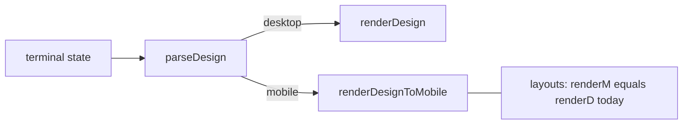

# 桌面/移动模式与布局变换分析报告

## 1. 代码现状（事实）

- **终端状态**：[`packages/adhere-ui-form-design/src/Design/index.tsx`](packages/adhere-ui-form-design/src/Design/index.tsx) 用 `terminal` → `currentTerminal`，Context 暴露 `getTerminal` / `setCurrentTerminal`（类型见 [`packages/adhere-ui-form-design/src/types/types.ts`](packages/adhere-ui-form-design/src/types/types.ts)：`Terminal = 'desktop' | 'mobile'`）。
- **解析入口**：[`packages/adhere-ui-form-design/src/Fields/parse/parseDesign.tsx`](packages/adhere-ui-form-design/src/Fields/parse/parseDesign.tsx) 在 `isDesktop(terminal)` 为真时走 `renderDesign`，否则走 `renderDesignToMobile`。
- **布局组件现状**：`FlexLayout`、`TableGridLayout`、`Card`、`Tabs`、`Collapse`、`Steps` 的 **`renderDesignToMobile` 全部是 `export { renderDesign as renderDesignToMobile }`**，即**布局树与桌面完全一致**，没有单独的移动端布局逻辑。
- **与布局无关但已分叉的 UI**：[`packages/adhere-ui-form-design/src/components/DesignFieldWrapper/index.tsx`](packages/adhere-ui-form-design/src/components/DesignFieldWrapper/index.tsx) 在移动端隐藏左上角类型标签，且 `renderActions` / `renderActionsToMobile` 目前多数布局也是互相同一导出——**模式切换对布局 JSON 几乎无影响**。
- **工具栏按钮**：[`changeDesktopMode/index.tsx`](packages/adhere-ui-form-design/src/Design/Toolbar/toolbarActions/changeDesktopMode/index.tsx) 与 [`changeMobileMode/index.tsx`](packages/adhere-ui-form-design/src/Design/Toolbar/toolbarActions/changeMobileMode/index.tsx) 的 `onClick` 仍为空，**未调用 `setCurrentTerminal`**。

---

## 2. 设计目标：你要的「变换」分两类

在谈「哪些属性怎么变」之前，必须先选定**产品语义**，否则规则会互相打架：

| 模式                              | 含义                                                   | 是否改 `designValue`                     |
| --------------------------------- | ------------------------------------------------------ | ---------------------------------------- |
| **A. 仅预览**                     | 画布按手机宽度/CSS 约束展示，数据仍是「一套」          | 否                                       |
| **B. 自动映射（切换时改写数据）** | 点「移动」就把整棵树的 `fieldProps` 按规则改掉         | 是（易**不可逆/丢信息**）                |
| **C. 断点覆盖（推荐长期形态）**   | 仍有一套「基准」配置 + `mobile` 增量覆盖，渲染时 merge | 是（结构扩展），切换**不丢**桌面专用配置 |

**结论**：若希望「桌面多列表单 → 手机单列」这类**强语义变化**，又不想丢桌面上的 `columnCount=4`，应优先走向 **C**；若只想让设计师「看见窄屏效果」，**A 足够**，不必动 `fieldProps`。

---

## 3. 总体原则（写进「变化规则」前的约束）

1. **可逆性**：任何「桌面 → 移动」的自动规则，若会丢失信息（例如多列 → 单列），必须在数据层有**单独存储**（覆盖对象或快照），不能原地覆盖唯一一份 `fieldProps`。
2. **根布局 vs 内嵌布局**：根节点（`isRootFieldId`）主要影响**滚动/占满**（见各布局里对 root 的 `overflow` 处理），变换规则应对 **非根** 与 **根** 区分或仅作用于非根，避免破坏画布外壳。
3. **子树递归**：表格栅格、Tabs/Collapse/Steps 的「槽位」与 `children[]` 下标绑定；**只改父级 `fieldProps` 不动 children** 通常就够用；若改列数，需保证 **子项数量与语义** 仍与 `data` / `tabItems` 等一致（当前 reducer 已部分处理增删，变换器应复用同一不变量）。
4. **与 `flexProps` 的关系**：`flexProps`（`minSize`、`scroll` 等）多作用于**设计器容器**，与业务「手机版排版」正交；建议 **默认不因终端切换而改 `flexProps`**，除非做「移动端画布更矮」等纯预览体验。

---

## 4. 分布局：属性语义 + 建议变化规则

以下按当前各布局 [`defaultValue.fieldProps`](packages/adhere-ui-form-design/src/Fields/layout/*/index.ts) 与属性面板（如 [`TableGridLayout/renderMainProperty.tsx`](packages/adhere-ui-form-design/src/Fields/layout/TableGridLayout/renderMainProperty.tsx)、[`FlexLayout/renderMainProperty.tsx`](packages/adhere-ui-form-design/src/Fields/layout/FlexLayout/renderMainProperty.tsx)、[`Tabs/InternalTabs.tsx`](packages/adhere-ui-form-design/src/Fields/layout/Tabs/InternalTabs.tsx)）对齐。

### 4.1 TableGridLayout（表格栅格，强相关）

**涉及主键**（来自默认与主属性面板）：`layout`、`bordered`、`density`、`mode`、`data[0].columnCount`、`data[0].colgroup`。

| 规则 ID | 场景                                | 建议（移动相对桌面）                                                                                                              | 备注                                                                                       |
| ------- | ----------------------------------- | --------------------------------------------------------------------------------------------------------------------------------- | ------------------------------------------------------------------------------------------ |
| TG-1    | `columnCount > 1`                   | **覆盖为 `1`**；`colgroup` 改为 `['auto']` 或单列 `['100%']`                                                                      | 典型「多列表单 → 窄屏纵排」；必须在 **C 模式**下写入 `mobileOverrides`，否则回桌面会丢列数 |
| TG-2    | `layout === 'horizontal'`（若存在） | 保持或改为 `vertical`（与你们字典语义一致时）                                                                                     | 以 TableGridLayout 实际 `layout` 枚举为准                                                  |
| TG-3    | `density`                           | **不要默认变「更紧凑」**；若追求触控，可考虑 `default` → `default` 或略增间距（取决于 adhere-ui-tablegridlayout 的 density 语义） | 移动端常要**更大点击区域**，「紧凑」常反模式                                               |
| TG-4    | `mode` / `bordered`                 | **默认不变**                                                                                                                      | 品牌/视觉由设计统一决定                                                                    |

**桌面 ← 移动**：若采用覆盖模型，应 **恢复桌面覆盖里保存的 `columnCount` 与 `colgroup`**，而不是从单列「猜」回多列。

### 4.2 FlexLayout（弹性布局）

**主键**：`direction`、`wrap`、`justifyContent`、`alignItems`、`alignContent`、`gap`。

| 规则 ID | 场景                                                                | 建议                                       | 备注                                                                             |
| ------- | ------------------------------------------------------------------- | ------------------------------------------ | -------------------------------------------------------------------------------- |
| FL-1    | `direction === 'horizontal'` 且子项较多或 `wrap === false` 且易溢出 | **可选**将覆盖设为 `direction: 'vertical'` | **高争议**：横向滚动业务（筛选条）不应被自动改；建议做成**可选向导**而非默认强制 |
| FL-2    | `gap`                                                               | 可在覆盖里 **+4~8px**（触控间距）          | 小步、可感知                                                                     |
| FL-3    | `justifyContent` / `alignItems`                                     | **默认不变**                               | 语义强依赖业务                                                                   |

### 4.3 Card

**主键**：`variant`、`size`、`hoverable`、`loading`、`autoHeight`。

| 规则 ID | 建议                                                                           | 备注                                              |
| ------- | ------------------------------------------------------------------------------ | ------------------------------------------------- |
| CD-1    | **默认不变**；若需触控，`size` 可在覆盖里 **升一档**（若 antd Card size 支持） | `hoverable` 在移动端意义弱，已为 `false` 时可忽略 |

### 4.4 Tabs（对齐 `InternalTabsLayoutProps`：`tabPlacement`、`type`、`size`、`centered` 等）

| 规则 ID | 场景                               | 建议                                                                             | 备注                                          |
| ------- | ---------------------------------- | -------------------------------------------------------------------------------- | --------------------------------------------- |
| TB-1    | `tabPlacement in ('left','right')` | 覆盖为 **`top`**                                                                 | 侧边 Tab 在窄屏极难用；**可逆**（存桌面覆盖） |
| TB-2    | Tab 项很多                         | 在移动端实现层打开 **横向滚动 tabBar**（若 antd/adhere Tabs 支持 `more`/scroll） | 属 **render 层策略**，可不写进 `fieldProps`   |
| TB-3    | `type`、`size`                     | **默认不变**                                                                     | 视觉由设计系统定                              |

### 4.5 Collapse

**主键**：`accordion`、`expandIconPosition`、`ghost`、`bordered`、`defaultActiveKey` 等。

| 规则 ID | 建议                                                      | 备注                                            |
| ------- | --------------------------------------------------------- | ----------------------------------------------- | ---------- |
| CP-1    | **默认不变**                                              | 长表单改 `accordion` 是强产品决策，不宜自动切换 |
| CP-2    | 若 `expandIconPosition` 为 `start` 且与移动端设计规范冲突 | 可在覆盖里改为 **`end`**（若 API 支持）         | 小步、可逆 |

### 4.6 Steps（`InternalSteps` 包在 `StepsSwiper` 上）

| 规则 ID | 场景                                                             | 建议                                                   | 备注                                             |
| ------- | ---------------------------------------------------------------- | ------------------------------------------------------ | ------------------------------------------------ |
| ST-1    | 桌面为横向步骤导航、且组件支持 `direction`/`responsive` 一类属性 | 移动覆盖 **`direction: 'vertical'`**（或组件等价 API） | 典型移动端步骤条；需在覆盖里保留桌面 `direction` |
| ST-2    | `size`                                                           | **可选**略增                                           | 触控与可读性                                     |

---

## 5. 「变化规则」落地形态（实现时二选一）

1. **仅预览（最小改动）**
   - 工具栏：`setCurrentTerminal('desktop'|'mobile')` + 编辑器容器 `max-width`（如 390px）与媒体查询。
   - **不改** [`DesignValue`](packages/adhere-ui-form-design/src/types/Design.ts) 结构；布局仍共用 `renderDesign`。

2. **断点覆盖（推荐与上表规则配套）**
   - 在 `DesignValueProps` 增加例如 `fieldPropsByTerminal?: { mobile?: Partial<FieldProps> }`（或各类型细化），`parseDesign` / 各 `Internal*` 在渲染前 **deep merge**（移动优先）。
   - 提供「同步到移动」「从移动清除覆盖」等显式动作，而不是静默覆盖。
   - **变换规则**实现为纯函数：`applyLayoutMobileOverrides(node)` / `clearOverrides`，可单测。

---

## 6. 与当前任务的衔接

- **立刻可做**：在 [`changeDesktopMode`](packages/adhere-ui-form-design/src/Design/Toolbar/toolbarActions/changeDesktopMode/index.tsx) / [`changeMobileMode`](packages/adhere-ui-form-design/src/Design/Toolbar/toolbarActions/changeMobileMode/index.tsx) 中从 `DesignContext` 取 `setCurrentTerminal` 并调用，即可打通与设计器一致的终端分支（仍不改变布局 JSON）。
- **若要做「布局变换」**：先定 **A / C**（不建议单独 **B** 原地改 JSON）；再按上表 **TG / TB / ST** 优先实现（收益最大、规则最清晰），**FL** 建议保守或做成可选。

---

## 7. 小结

- 今天代码里**移动模式并不会改变各 layout 的 `fieldProps`**，只影响少量外壳 UI；真正的「布局变换」尚未存在。
- **合理**做法是：要么只做**窄屏预览**，要么引入**按终端的覆盖存储**再应用上表规则，避免「切换一次丢桌面配置」。
- **优先级建议**：`TableGridLayout`（列数/colgroup）> `Tabs`（侧栏转顶栏）> `Steps`（纵向）> `FlexLayout`（谨慎）> `Card`/`Collapse`（默认不动）。
