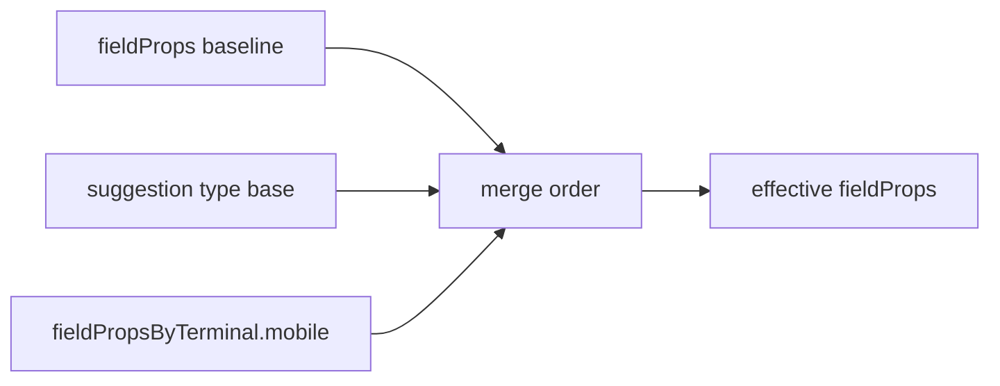

# 补齐「移动端布局建议」显示层

## 问题根因

当前 [`mergeFieldPropsForTerminal`](packages/adhere-ui-form-design/src/utils/fieldPropsTerminal.ts) 在 `terminal === 'mobile'` 时只做 `merge(base, fieldPropsByTerminal?.mobile)`。若从未写入 `fieldPropsByTerminal.mobile`，**overlay 为空**，有效 `fieldProps` 与桌面一致，因此看不到计划中 §4 各布局的「建议变化」。

计划中列出的 **`buildDefaultMobileFieldPropsOverrides` / 分布局规则** 未实现，仅实现了数据结构与合并管线。

## 目标行为

- 切换到 **mobile** 时，在 **不强制写回 JSON** 的前提下，渲染使用：
  - `effective = merge({}, base, suggestion(type, base), persistedMobileOverlay)`
- **优先级**：用户已持久化的 `fieldPropsByTerminal.mobile` **覆盖**同键上的建议值（lodash `merge` 顺序：先 `suggestion`，再 `overlay`）。
- **desktop**：行为不变，仍为 `fieldProps`。
- **Flex / Card / Collapse**：与先前计划一致——**默认不生成建议**（避免误伤横向业务布局）；若后续要加 Flex 规则，再单独开关。

## 实现要点

### 1. 新增纯函数模块（可测、可复用）

在 [`packages/adhere-ui-form-design/src/utils`](packages/adhere-ui-form-design/src/utils) 新增例如 **`mobileLayoutSuggestionPatch.ts`**（名称可微调），导出：

```ts
/** 仅基于 type + 基线 fieldProps 推导「移动端建议 patch」，不写 store */
export function getMobileLayoutSuggestionPatch(
  type: string,
  baseFieldProps: FieldProps,
): Partial<FieldProps>;
```

内部用 **`type` 字符串** 与各布局 [`constant.ts` 的 `TYPE`](packages/adhere-ui-form-design/src/Fields/layout/TableGridLayout/constant.ts) 比对（避免 utils 反向 import 大组件），分派规则建议与先前分析对齐：

| 布局 type                                                                                                     | 建议 patch（与当前代码结构对齐）                                                                                                                                                                                                                                                                                                                  |
| ------------------------------------------------------------------------------------------------------------- | ------------------------------------------------------------------------------------------------------------------------------------------------------------------------------------------------------------------------------------------------------------------------------------------------------------------------------------------------- |
| `table-grid-layout`                                                                                           | 若 `data?.[0]?.columnCount > 1`：`{ data: [{ ...data[0], columnCount: 1, colgroup: ['auto'] }] }`（注意保留 `data[0]` 其它字段）；可选：若 `layout === 'horizontal'` 则建议 `vertical`（以 TableGrid 实际枚举为准，需读 [`renderMainProperty`](packages/adhere-ui-form-design/src/Fields/layout/TableGridLayout/renderMainProperty.tsx) / types） |
| `tabs-layout`（以 [`Tabs/constant`](packages/adhere-ui-form-design/src/Fields/layout/Tabs/constant.ts) 为准） | 若 `tabPlacement` 为 `left` / `right`：`{ tabPlacement: 'top' }`（与 [`InternalTabs`](packages/adhere-ui-form-design/src/Fields/layout/Tabs/InternalTabs.tsx) 一致）                                                                                                                                                                              |
| `steps-layout`                                                                                                | Steps 的 `direction` 语义为 StepsSwiper 的 `top` 等，**不宜**照搬 antd 的 `vertical`。建议改为：若 `titlePlacement === 'horizontal'`（见 [`Steps/index.ts` 默认](packages/adhere-ui-form-design/src/Fields/layout/Steps/index.ts)），则建议 `{ titlePlacement: 'vertical' }`；若后续确认还有更合适的「窄屏步骤条」字段，再替换                    |
| 其它类型                                                                                                      | 返回 `{}`                                                                                                                                                                                                                                                                                                                                         |

单元测试可选：对几组典型 `baseFieldProps` 断言 patch 形状（不跑全包 e2e 亦可）。

### 2. 扩展合并 API

在 [`fieldPropsTerminal.ts`](packages/adhere-ui-form-design/src/utils/fieldPropsTerminal.ts) 中：

- 将 `mergeFieldPropsForTerminal` 增加参数 **`type: string`**（或 `FieldType`）。
- 实现：`merge({}, base, getMobileLayoutSuggestionPatch(type, base), overlay)`（仅 `terminal === 'mobile'` 分支）。

更新 [`withMergedFieldPropsForTerminal`](packages/adhere-ui-form-design/src/utils/fieldPropsTerminal.ts) 调用处传入 **`value.type`**。

### 3. 与属性面板 / 写回 的一致性

- [`PropertiesTab`](packages/adhere-ui-form-design/src/Design/Properties/PropertiesTab/index.tsx) 使用的合并逻辑需与 `parseDesign` **同源**（同样传入 `type`），避免面板展示与画布不一致。
- 现有 `setFieldProps` → `computeFieldPropsOverlayPatch(rawBase, incoming)` **仍以 store 中的 raw `fieldProps` 为基线**，不改为「基线+建议」；用户保存的仍是 **真实差量**。展示层多出的建议由合并顺序保证，**无需改 reducer**。

### 4. 导出与文档

- 在 [`utils/index.ts`](packages/adhere-ui-form-design/src/utils/index.ts) 导出 `getMobileLayoutSuggestionPatch`（若对外需要）。
- 在仓库内计划文档或包内简短注释说明：**建议层非持久化**，清除/未配置 `fieldPropsByTerminal.mobile` 时仍生效；持久化层优先。



## 风险与边界

- **TableGrid `data` 深合并**：`lodash.merge` 对数组默认按索引合并；若建议整段替换 `data[0]`，建议 patch 直接给出完整 `data[0]` 对象，与当前 reducer 行为一致。
- **Steps 字段语义**：以设计器已暴露的 `titlePlacement` / `direction` 为准，实施前在 `InternalSteps` / 属性面板再核对一遍，避免建议无效属性。

## 实施顺序

1. 新增 `getMobileLayoutSuggestionPatch` + 布局分派表。
2. 改 `mergeFieldPropsForTerminal` / `withMergedFieldPropsForTerminal` + `PropertiesTab` 传 `type`。
3. 手动切换 desktop/mobile 验证：多列表格栅格变单列、侧栏 Tabs 变顶栏、Steps 标题纵向等（按最终字段定案）。
